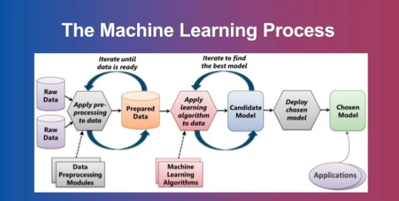

# Placement Prediciton 

## This project is built to find whether a student gets a placement or not, based on several attributes
## Algorithm: Logistic Regression
## Tech-Stack: Python, Streamlit
## The attibutes that are taken into consideration are:
1. Age
2. Gender
3. Stream
4. Interhsip Details
5. CGPA
6. Backlog History
